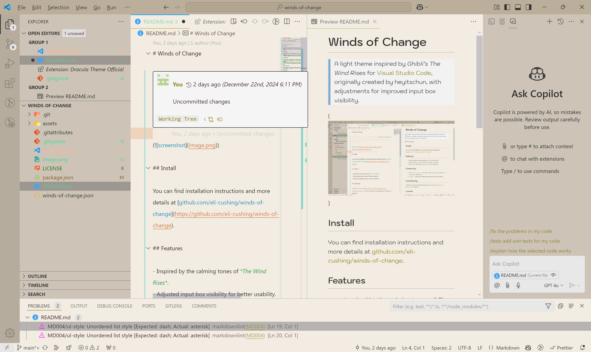

# Winds of Change

> A light theme inspired by _Ghibli's The Wind Rises_ for [Visual Studio Code](http://code.visualstudio.com), originally created by heyitschun, with adjustments for improved input box visibility.



## Install

### Install using Command Palette

1. Go to **View** -> **Command Palette** or press `Ctrl+Shift+P`.
2. Then enter **Install Extension**.
3. Write **Winds of Change**.
4. Select it or press **Enter** to install.

### Install using Git

If you are a git user, you can install the theme and keep it up to date by cloning the repo:

```bash
git clone https://github.com/eli-cushing/winds-of-change.git ~/.vscode/extensions/winds-of-change
cd ~/.vscode/extensions/winds-of-change
npm install
npm run build
```

### Activating theme

1. Run **Visual Studio Code**.
2. The **Winds of Change** theme will be available from **File** -> **Preferences** -> **Color Theme** dropdown menu.

## Features

- Inspired by the calming tones of _The Wind Rises_ by @heyitschun.
- Adjusted input box visibility for better usability.
- Enhanced readability across various UI elements.

## Contributing

1. Fork and clone this repo: `git clone https://github.com/<YOUR-USERNAME>/winds-of-change`.
2. Create a branch for your changes: `git checkout -b my-new-feature`.
3. Install dependencies: `npm install`.
4. Open the _winds-of-change_ folder in VSCode.
5. Hack away.
6. Build and examine your changes in an Extension Development Host.
   - Debug > Start Debugging or use `F5` as a shortcut.
7. Commit and push your changes.
8. Submit a PR for discussion, keeping in mind that not all suggestions can be accepted.

## License

[MIT License](./LICENSE.txt)
